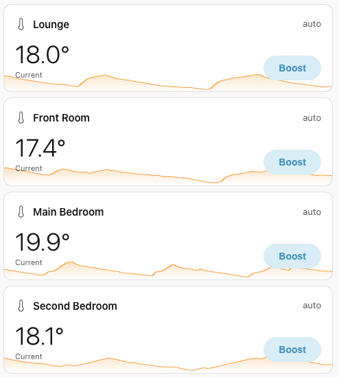
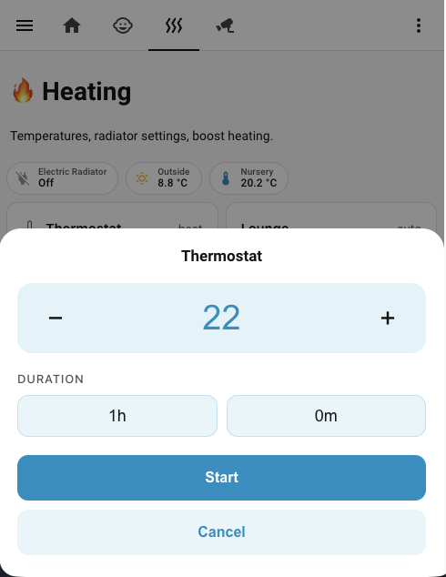

# Hive Boost — Home Assistant Custom Integration

Adds per-room boost control for Hive TRVs in Home Assistant. Auto-discovers all your Hive climate entities and gives you a configurable dashboard card for each room — no YAML helpers required.

## Features

- Auto-discovers all Hive climate entities — no manual configuration per room
- Individual dashboard cards you can place on any dashboard
- Boost state persisted across HA restarts
- `hive_boost.start_boost` and `hive_boost.cancel_boost` services for use in automations
- Sensor entities per TRV exposing boost state, temperature, and time remaining
- Events fired on boost start, end, and cancel — hook into your own automations

## Example





## Requirements

- Home Assistant 2026.3.1+
- [Hive](https://www.home-assistant.io/integrations/hive/) integration installed and configured with at least one TRV

## Installation

### HACS (recommended)

1. Open HACS → **Integrations** → ⋮ → **Custom repositories**
2. Add this repository URL, category: **Integration**
3. Search for **Hive Boost** and install
4. Restart Home Assistant

### Manual

Copy the `custom_components/hive_boost/` folder into your `config/custom_components/` directory, then restart Home Assistant.

### Add the integration

Go to **Settings → Devices & Services → + Add Integration**, search for **Hive Boost**, and follow the setup wizard.

## Dashboard cards

After installation, add boost cards to any dashboard via **Add card → Manual**:

```yaml
type: custom:hive-boost-card
entity: climate.lounge
```

Each card shows the room's current temperature, heating state, and boost status. Tap **Boost** to expand the card and choose a temperature and duration. You can add as many cards as you like, on as many dashboards as you like — mix and match rooms per view.

**All options:**

```yaml
type: custom:hive-boost-card
entity: climate.main_bedroom   # required — climate.* or sensor.*_boost
name: Main Bedroom             # optional — display name override (auto-detected if omitted)
icon: mdi:bed                  # optional — any MDI icon; omit for default thermometer
show_graph: true               # optional — show 24 h temperature history graph in background
button_label: Heat             # optional — label for the boost button (default: "Boost")
stop_label: Stop               # optional — label for the stop button (default: "Stop boost")
show_button: false             # optional — hide the boost/stop button (default: true)
show_status: false             # optional — hide the status text (default: true)
```

| Option | Required | Description |
|---|---|---|
| `entity` | Yes | A Hive climate entity (`climate.*`) or its corresponding boost sensor (`sensor.*_boost`) |
| `name` | No | Override the display name shown on the card. Defaults to the entity's friendly name |
| `icon` | No | Any [MDI icon](https://pictogrammers.com/library/mdi/) e.g. `mdi:bed`. Omit for the default thermometer |
| `show_graph` | No | Set to `true` to show the last 24 hours of temperature history as a background sparkline |
| `button_label` | No | Custom label for the boost button. Defaults to `Boost` |
| `stop_label` | No | Custom label for the stop button shown during an active boost. Defaults to `Stop boost` |
| `show_button` | No | Set to `false` to hide the boost/stop button. Useful for display-only cards. Defaults to `true` |
| `show_status` | No | Set to `false` to hide the status text (e.g. "Off", "45m left"). Defaults to `true` |

### Card behaviour

- On **mobile** the boost picker opens as a bottom sheet sliding up from the bottom of the screen.
- On **desktop** (≥ 600 px) it opens as a centred dialog.
- The temperature field supports keyboard input as well as the ± buttons.
- Duration is set with two dropdowns (hours and minutes) using the native OS picker on mobile.

## Services

### `hive_boost.start_boost`

Start a boost on a specific Hive TRV.

| Field | Type | Default | Description |
|---|---|---|---|
| `entity_id` | entity | — | Hive climate entity (e.g. `climate.lounge`) |
| `temperature` | float | 22.0 | Target temperature in °C (5–32) |
| `duration_minutes` | int | 60 | Duration in minutes (15–180) |

### `hive_boost.cancel_boost`

Cancel an active boost and return the TRV to its schedule.

| Field | Type | Description |
|---|---|---|
| `entity_id` | entity | Hive climate entity to cancel |

## Sensor entities

One `sensor.<room>_boost` entity is created per discovered Hive TRV.

**State:** `boosting` or `idle`

| Attribute | Description |
|---|---|
| `boost_active` | `true` while a boost is running |
| `boost_temperature` | Target temperature in °C |
| `boost_duration` | Duration in minutes |
| `boost_ends_at` | ISO timestamp when the boost expires |
| `minutes_remaining` | Minutes left on the current boost |
| `current_temperature` | Mirrored from the climate entity |
| `hvac_mode` | Mirrored from the climate entity |

## Events

| Event | Payload | Description |
|---|---|---|
| `hive_boost_boost_started` | `entity_id`, `temperature`, `duration_minutes` | Fired when a boost begins |
| `hive_boost_boost_ended` | `entity_id` | Fired when a boost expires naturally |
| `hive_boost_boost_cancelled` | `entity_id` | Fired when a boost is cancelled manually |

Use these in your own automations — for example, send a notification when the nursery boost ends.

## Contributing

See [docs/developers.md](docs/developers.md) for architecture notes and the development workflow.
